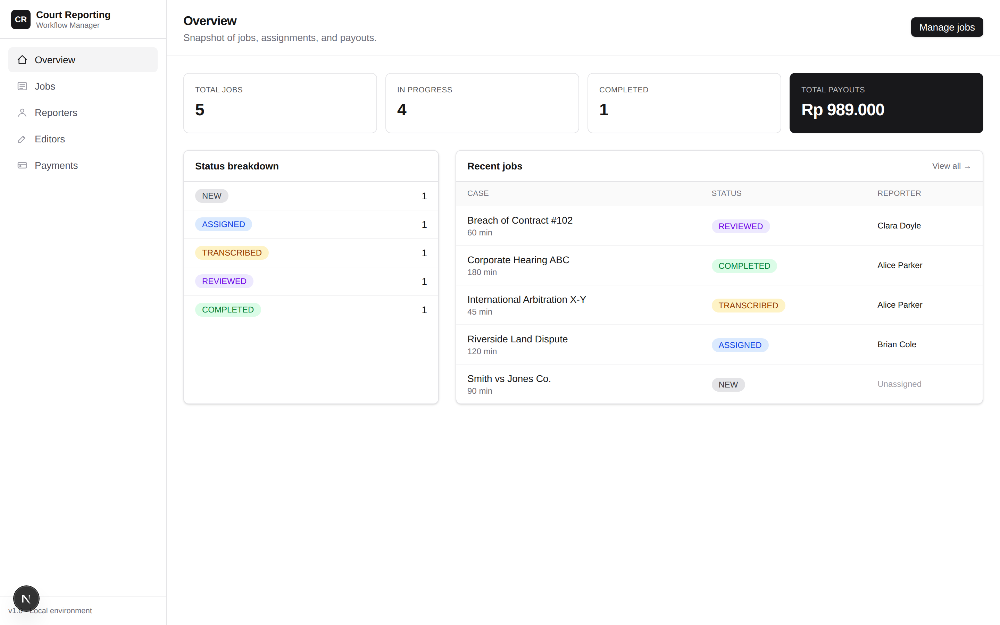

# Court Reporting Workflow Manager

A workflow system for a court reporting agency to manage transcription jobs from intake to payout — assign reporters and editors, track jobs through a strict 5-state workflow, and calculate payments automatically.



## Quick Start

**Prerequisites:** Node.js ≥ 20.9, PostgreSQL ≥ 13, npm.

```bash
# 1. Backend
cd backend
cp .env.example .env          # then edit DB credentials
npm install
npm run seed                  # creates schema + sample data
npm run dev                   # http://localhost:4000

# 2. Frontend (in a new terminal)
cd frontend
npm install
npm run dev                   # http://localhost:3000
```

Open [http://localhost:3000](http://localhost:3000).

## Tech Stack

| Layer | Stack |
|---|---|
| Frontend | Next.js 16 (App Router), React 19, TypeScript, Tailwind CSS v4 |
| Backend | Node.js, TypeScript, Express 5, Sequelize |
| Database | PostgreSQL |

## How It Works

### The Workflow — a strict state machine

```
NEW  →  ASSIGNED  →  TRANSCRIBED  →  REVIEWED  →  COMPLETED
        (reporter   (raw transcript   (editor       (final)
         assigned)   produced)         reviewed)
```

Backend-enforced rules:

- Forward-only, one step at a time
- Cannot reach `TRANSCRIBED` without an assigned reporter
- Cannot reach `REVIEWED` without an assigned editor
- API independently validates — UI guards are for UX, not security

### Payment Rules

- **Reporter:** `durationMinutes × ratePerMinute` — counted once assigned
- **Editor:** flat fee per job — counted only once status reaches `REVIEWED`

Earnings are computed on-demand, not stored. Rates can change without migrations; the displayed amounts always reflect the current schedule.

### Smart Reporter Assignment

For each job, the system can recommend a reporter:

- **Physical job** → prefer available reporter whose `location` matches the job's `city`
- **Remote job** → any available reporter
- **Fallback** → if no same-city match, pick from another city

Operators can override the suggestion. Assignment dropdowns also surface a `busy: N` hint when a reporter already has active jobs — informational, not blocking.

## Try It

A 1-minute walkthrough that touches every feature:

1. Open **Jobs**, click **"+ New job"**, create a Physical job in Jakarta (e.g. 90 min).
2. In the new row, click **Suggest** → it should recommend a Jakarta-based reporter. Click the suggestion to assign.
3. Click **Advance → TRANSCRIBED**.
4. Assign an editor from the dropdown.
5. Click **Advance → REVIEWED**, then **Advance → COMPLETED**.
6. Open **Payments** — verify reporter earns `90 × ratePerMinute` and the editor earns their flat fee.
7. Open **Reporters**, click the green **Available** pill on any reporter to toggle them to **Unavailable**. They will disappear from future assignment dropdowns.

## Project Structure

```
.
├── backend/          # REST API — see backend/README.md for API reference
├── frontend/         # Next.js dashboard — see frontend/README.md for UI details
├── docs/             # Screenshots
└── README.md         # This file
```

| Path | Documentation |
|---|---|
| [`backend/`](backend/README.md) | Setup, environment, full API endpoint reference |
| [`frontend/`](frontend/README.md) | Setup, pages, component structure |

## Architecture

```
 ┌─────────────────┐   REST/JSON   ┌─────────────────┐   SQL    ┌──────────────┐
 │  Next.js 16     │ ────────────▶ │  Express 5      │ ───────▶ │  PostgreSQL  │
 │  React 19       │ ◀──────────── │  TypeScript     │ ◀─────── │              │
 │  Tailwind v4    │               │  Sequelize ORM  │          │              │
 └─────────────────┘               └─────────────────┘          └──────────────┘
       browser                       services/ (pure logic)
                                     controllers/ (HTTP)
                                     routes/ (wiring)
```

Business rules live in `backend/src/services/` (pure functions: payment calculation, reporter suggestion). HTTP concerns stay in `controllers/`. This keeps the domain layer testable and portable — the same logic could power a CLI tool or a queue worker without changes.

## Key Decisions & Trade-offs

| Decision | Reasoning |
|---|---|
| State machine over free-form status | Prevents invalid combinations like "COMPLETED with no reporter" at the data layer |
| Validation in backend **and** UI | Defense in depth — API holds even if a client bypasses the UI |
| Earnings derived, not stored | No drift; rate changes don't require data migration. Historical immutability would need snapshotting — deferred as a future concern |
| Soft "busy" warnings vs hard blocking | Real ops need an escape hatch; the UI informs, doesn't restrict |
| No authentication | Out of scope for the assessment. JWT/bcrypt deps are in place if needed later |